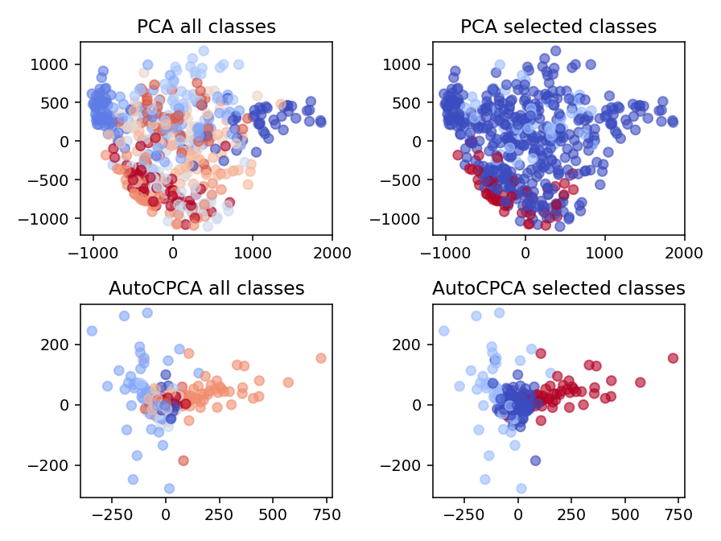

# AutoCPCA 
Automatic Contrasitve Priniciple Components Analysis (AutoCPCA) is a python library to perform a supervised version 
of the well-know dimensional reduction technique PCA.
This is an adaption to reference [1]. Install via pip

    pip install git+https://github.com/lucasplagwitz/auto_cpca

## Concept

The concept is based on the work in reference [1] and weights dimensions based on 
fore- and background. In this case, backgrounds are automatically defined on the given class labels. 
Thus, high variance within the class is penalized and the dimensions to distinguish between classes are emphasized. 

In particular we solve:
<p align="center">

 <p/>
where ...

To demonstrate the behavior, the following figure shows the result on example mnist_2d_plot.py. 

<p align="center">

</p>

To better distinguish 2 and 7 from the rest, the dissimilarity of all digits except 2 and 7 is penalized.


## Performance

The concept is fully compatible with the scikit-learn API and can thus be directly intigrated into your ML-pipeline.

```python
from sklearn.pipeline import Pipeline
from sklearn.svm import SVC
from sklearn.model_selection import GridSearchCV, StratifiedShuffleSplit
from sklearn.datasets import fetch_olivetti_faces

from auto_cpca import AutoCPCA

cpca_parameters = {'AutoCPCA__n_components': [5, 50, None],
                   'AutoCPCA__alpha': [.1, 1, 5],
                   'SVC__C': [1, 10]}

auto_cpca_pipe = Pipeline([("AutoCPCA", AutoCPCA(verbose=0)), ("SVC", SVC())])

clf = GridSearchCV(auto_cpca_pipe, cpca_parameters, cv=StratifiedShuffleSplit(n_splits=10, test_size=.2, random_state=42))
X, y = fetch_olivetti_faces(return_X_y=True)
clf.fit(X, y)
```

The performance results of examples/perforamces_overview.py:

|   | Direct  | Feature-Selection  | PCA  | AutoCPCA  |
|:---:|:---:|:---:|:---:|:---:|
| best mean of 10-CV-scoring  | 0.96  | 0.969 | 0.955  | **0.988**  |
|  std of best 10-CV-scoring  | 0.192  | 0.196 | 0.0218   | **0.0137**  |

## References
[1] Abid, Abubakar and Zhang, Martin J and Bagaria, Vivek K and Zou, James: `"Exploring Patterns Enriched in a Dataset with Contrastive Principal Component Analysis"
<https://www.nature.com/articles/s41467-018-04608-8.pdf/>`_, *Nature Communications* (2018)