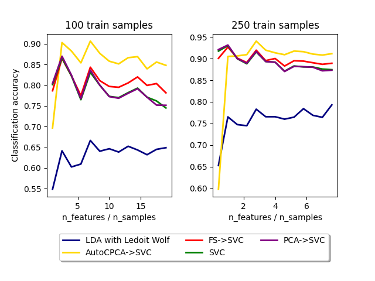

# AutoCPCA 
Automatic Contrasitve Priniciple Components Analysis (AutoCPCA) is a python library to perform a supervised version 
of the well-known dimensional reduction technique PCA.
This is an adaptation of reference [1]. Install via pip

    pip install git+https://github.com/lucasplagwitz/auto_cpca

## Concept

The concept is based on the work in reference [1] and weights feature-dimensions based on 
fore- and background. In this case, backgrounds are automatically defined on the given class labels. 
Thus, high variance within the class is penalized and the dimensions to distinguish between classes are emphasized. 
This results in a similar formulation to the Fisher discriminant analysis: finding a reduced representation of the data such that 
intraclass variation is minimized while interclass variation is maximized.

In particular we solve:
<p align="center">

 <p/>
where  and  the covariance matrix and  a weighting paramater.

This reudction method seems to perform well on datasets with very small samples at high feature counts.
To demonstrate the behavior, the following figure shows the result on example examples/features_per_sample_comparison.py

<p align="center">

</p>

The investigation of advantages and disadvantages to the LDA/QDA and general purposes is still in progress.

## Performance

The concept is fully compatible with the scikit-learn API and can thus be directly intigrated into your ML-pipeline.

```python
from sklearn.pipeline import Pipeline
from sklearn.svm import SVC
from sklearn.model_selection import GridSearchCV, StratifiedShuffleSplit
from sklearn.datasets import fetch_olivetti_faces

from auto_cpca import AutoCPCA

cpca_parameters = {'AutoCPCA__n_components': [5, 50, 100, None],
                   'AutoCPCA__alpha': [.1, 1, 5],
                   'SVC__C': [1, 10]}

auto_cpca_pipe = Pipeline([("AutoCPCA", AutoCPCA(verbose=0)), ("SVC", SVC())])

clf = GridSearchCV(auto_cpca_pipe, cpca_parameters, cv=StratifiedShuffleSplit(n_splits=10, test_size=.2, random_state=42))
X, y = fetch_olivetti_faces(return_X_y=True)
clf.fit(X, y)
```

The performance results of examples/perforamce_faces.py:

|   | Direct  | Feature-Selection  | PCA  | LDA | AutoCPCA  |
|:---:|:---:|:---:|:---:|:---:|:---:|
| best mean of 15-CV-scoring  | 0.959  | 0.968 | 0.957  | **0.99** | **0.99**  |
|  std of best 15-CV-scoring  | 0.0191  | 0.0176 | 0.0198 | **0.0131** | **0.0114**  |

Results of examples/performance_mouse.py:

|   | Direct  | Feature-Selection  | PCA | LDA | AutoCPCA  |
|:---:|:---:|:---:|:---:|:---:|:---:|
| best mean of 15-CV-scoring  | 0.735  | 0.609 | 0.715  | 0.692 | **0.851**  |
|  std of best 15-CV-scoring  | 0.0191  | 0.0176 | 0.0437  | 0.072 | **0.0587**  |


## References
[1] Abid, Abubakar and Zhang, Martin J and Bagaria, Vivek K and Zou, James: [Exploring Patterns Enriched in a Dataset with Contrastive Principal Component Analysis](https://www.nature.com/articles/s41467-018-04608-8.pdf), *Nature Communications* (2018)
